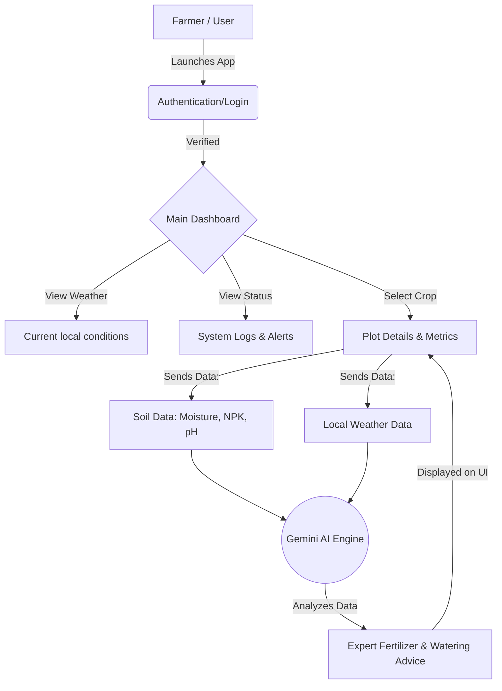
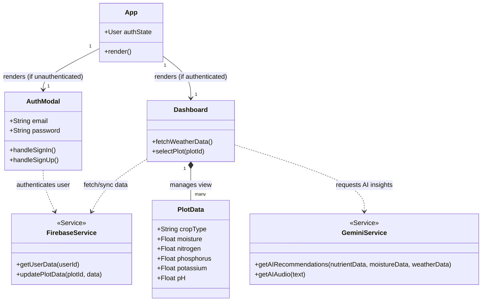

# WNM Helper - Comprehensive User Manual

WNM Helper is an intelligent application designed to manage, monitor, and assist with agricultural crop plots (such as Yam, Pepper, Pak Choy, Tomato, and Corn). It uses Gemini AI to provide crop recommendations based on nutrient data, moisture levels, and weather conditions.

## 📖 Table of Contents
1. [Installation & Setup](#1-installation--setup)
   - [Running the Pre-Packaged App](#option-1-desktop-application-windows-installer)
   - [Running from Source Code](#option-2-running-from-source-code-web-application)
2. [Building the Executable (.exe)](#2-building-the-executable-exe)
3. [Fixing Common Local Errors](#3-fixing-common-local-errors)
4. [Using the Application](#4-using-the-application)
   - [Authentication / Login](#authentication--login)
   - [Dashboard & Weather Overview](#dashboard--weather-overview)
   - [Managing Application Logs](#managing-application-logs)
   - [Generating Gemini AI Recommendations](#generating-gemini-ai-recommendations)

---

## 1. Installation & Setup

### Option 1: Desktop Application (Windows Installer)
If you have been provided with the `WNM-helper setup.exe` file:
1. Locate the `WNM-helper setup.exe` file on your computer.
2. Double-click the executable to launch the installation wizard.
3. Follow the on-screen instructions to select your installation directory and create desktop shortcuts.
4. Once the installation is complete, you can launch **WNM Helper** directly from your desktop.
*(Note: Once installed, you do not need to keep the original setup.exe file in the same folder as the installed program. The installed app runs independently).*

### Option 2: Running from Source Code (Web Application)
If you have the source code folder and want to run the web version locally:

1. **Install Node.js** (Version 18 or higher recommended).
2. **Open your Terminal or Command Prompt:**
   Navigate into the project directory:
   ```bash
   cd path/to/wnm-helper
   ```
3. **Install Dependencies:**
   Run the following command to download all required software packages:
   ```bash
   npm install
   ```
4. **Configure the Environment:**
   - Rename `.env.example` to `.env`.
   - Open `.env` and add your Gemini API Key: `GEMINI_API_KEY="your_actual_api_key_here"`
5. **Start the Application:**
   ```bash
   npm run dev
   ```
   *Open `http://localhost:3000` in your web browser.*

---

## 2. Building the Executable (.exe)

I have updated the project code here to properly include the `electron` settings! When you export this project to your computer as a ZIP, follow these steps to build the `.exe`:

1. Open a Command Prompt in the extracted folder.
2. Ensure you install all packages, including development packages (this fixes the `vite` and `electron-builder` not recognized errors):
   ```bash
   npm install
   ```
3. Run the Windows executable build script:
   ```bash
   npm run build:exe
   ```
4. This command will first run `vite build` (to compile the user interface), and then run `electron-builder` to package it into an `.exe`. 
5. You will find the generated Setup file in the `release/` folder.

---

## 3. Fixing Common Local Errors (Your Screenshots)

If you see these errors in your command prompt:

* **`Missing script: "build"`**: Your `package.json` was missing the `build` or `build:exe` script. I have fixed this in the current code.
* **`'vite' is not recognized`**: Your local computer is missing the Vite dependency. Running `npm install` usually fixes this.
* **`'electron-builder' is not recognized`**: Electron Builder was not properly added to the `package.json` as a dev dependency. I have also fixed this in this project export.
* **`Package "electron" is only allowed in "devDependencies"`**: This occurs if `electron` or `electron-builder` were installed as standard dependencies. I have fixed this in `package.json` by adding them only to `devDependencies` and also setting the required `author` and `description` fields.

**How to resolve:** Please delete your local `node_modules` folder and `package-lock.json` file if they exist. **Re-export the app as a ZIP from AI Studio**, then locally run:
```bash
npm install
npm run build:exe
```
This fresh start will clean out the old mixed packages and it should build cleanly!

---

## 4. Application Architecture & Data Flow

Below is a visual representation of how WNM Helper works, from launching the application to receiving AI recommendations.



### Core Architecture (UML Class Diagram)

This UML structure outlines the major internal modules and services comprising the application's interactive layer.



---

## 5. Using the Application

### Authentication / Login
- **Sign In/Sign Up**: When you first open the app, you will be prompted to login. You must provide an email and password. If you do not have an account, you can toggle the form to "Register".
- *Important*: The app requires a functional Firebase setup or mock state (depending on what you configured) to log you in.

### Dashboard & Weather Overview
Once logged in, the primary dashboard displays:
- **Weather Panel**: Displays current location temperature, humidity, wind speeds, and a short text forecast, helping you plan your crop watering or harvesting for the day.
- **My Plots**: A grid view showing all your monitored crops. It lists the crop type (e.g., Yam, Pepper), its health status (Excellent, Good, Critical), and key metrics like soil moisture, NPK levels (Nitrogen, Phosphorus, Potassium), and pH context.

### Managing System Logs
- **System Logs Section**: Situated on the dashboard, this acts as an alert center. It logs system startup details, successful data syncs, and notifications.
- **Log Management**: You can clear older logs to declutter the area using the provided UI controls.

### Generating Gemini AI Recommendations
- Navigating to the details of a specific plot allows you to request an AI Analysis.
- **How it works:** By pressing the "**Get Expert Advice**" button, the application securely sends the soil metrics (Moisture, NPK, pH) and the current weather context directly to Google's Gemini AI. 
- **The Result**: You receive a comprehensive, human-readable recommendation on how to optimize your fertilizers or water levels. 

---
## 🛠 Troubleshooting (Updated for Electron)

### Fixing the Blank/White Screen in the Executable
If you are seeing a completely white screen when running your application, it is almost certainly a conflict between **Electron's Node Integration** and the React/Vite bundle. You must edit your `main.cjs` file to look like this:

```javascript
const { app, BrowserWindow } = require('electron');
const path = require('path');

function createWindow() {
  const win = new BrowserWindow({
    width: 1200,
    height: 800,
    webPreferences: {
      // ⚠️ DO NOT USE nodeIntegration: true! It crashes React/Vite builds.
      nodeIntegration: false,
      contextIsolation: true
    },
    // Adding your icon here makes it appear in the taskbar when running
    icon: path.join(__dirname, 'public', 'WNM logo 2.png')
  });

  // Turn this on temporarily to see errors! Once fixed, delete this line.
  // win.webContents.openDevTools();

  // Loads the compiled React app
  win.loadFile(path.join(__dirname, 'dist', 'index.html'));
  win.setMenuBarVisibility(false);
}

app.whenReady().then(createWindow);

app.on('window-all-closed', () => {
  if (process.platform !== 'darwin') {
    app.quit();
  }
});
```

### Applying your App Icon to the `.exe` file
To make sure your `WNM logo 2.png` is embedded correctly in the `.exe` that gets generated by electron-builder, your `package.json` should have this block under "win":

```json
"build": {
  "win": {
    "target": "nsis",
    "icon": "public/WNM logo 2.png" 
  }
}
```
*Note: Make sure your image name exactly matches the actual file name, including capitalization and spacing.*
